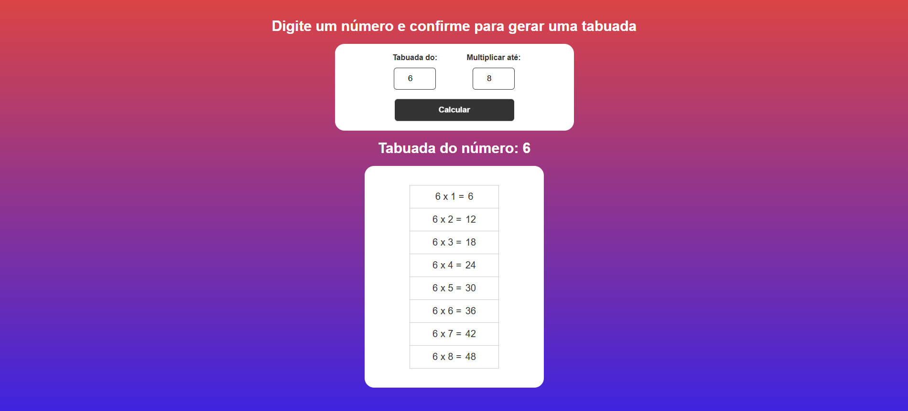
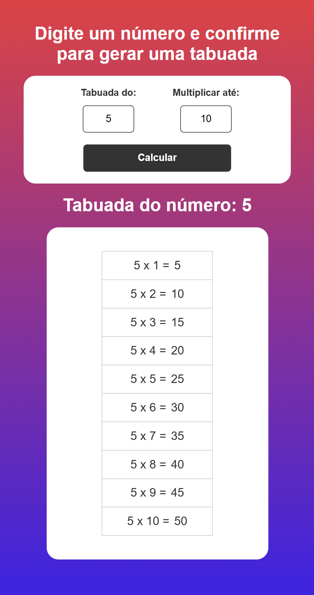

# 🎯 Multiplication Table

A modern, responsive, and elegant web application for dynamic multiplication table generation, featuring user-controlled limits and instant DOM rendering.

---

## 📸 Preview

<p align="center">
  
  
</p>

## 🚀 Technologies Used

- **HTML5:** Semantic structuring of the application layout, utilizing appropriate input types and form elements.
- **CSS3:** Modern styling utilizing fluid transitions, custom Google Fonts (`Poppins`), structural Flexbox alignment, and responsive media queries for cross-device compatibility.
- **JavaScript (ES6+):** Pure DOM manipulation and event-driven programming implementing:
  - Dynamic event listeners (`addEventListener`) to intercept form submissions.
  - Template literals for clean HTML string generation and injection.
  - Interactive element creation and programmatic CSS class manipulation.

---

## 🧠 Core Learnings & Implementation Concepts

The main objective of this project was to master user input validation, dynamic list rendering, and seamless DOM state manipulation in vanilla JavaScript. Key architectural concepts mastered include:

1. **Dynamic DOM Manipulation & List Clearing:** Implementing standard DOM purging techniques by resetting dynamic container contents (`tableOperations.innerHTML = ""`) before each render cycle, preventing cumulative list overhead and ensuring accurate, state-clean UI updates.

2. **Form Submission Interception:** Preventing default browser behaviors using `e.preventDefault()` within the form submit event. This allowed for manual extraction of numeric values, custom input validation, and internal application execution without causing a page reload.

3. **Responsive Interface & Math Logic Separation:** Structuring logic to dynamically calculate mathematical equations on the fly using a standard `for` loop up to user-defined limits, instantly mapping the data array into programmatic HTML rows.

---

## 📦 How to Run the Project Locally

### 1. Clone this repository:

```bash
git clone https://github.com/luisfrancisco2b/multiplication-table
```

### 2. Navigate to the project folder

```bash
cd multiplication-table
```

### 3. 🚀 Running the Project

```bash
Since this is a front-end application, you can run it directly.

Open Open the `index.html` file in your browser, or run it using an extension like **Live Server** in VS Code:

http://127.0.0.1:5500/index.html
```

## 👨‍💻 Author

Luis Francisco